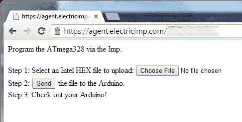
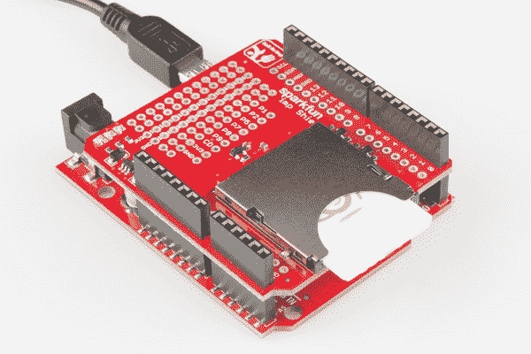

# 带电动 Imp 的无线 Arduino 编程

> 原文：<https://learn.sparkfun.com/tutorials/wireless-arduino-programming-with-electric-imp>

## 入门指南

[](https://cdn.sparkfun.com/assets/3/9/0/a/f/52f7ecd6ce395fcd7f8b4567.png)*Loading a new sketch via wireless*

本教程将向您展示如何使用电动 Imp 从网页中重新编写 Arduino 程序。是的，你没看错。现在你可以在世界任何地方重新编程一个 Arduino(和一个 Imp )!

[](https://cdn.sparkfun.com/assets/9/7/a/c/f/52f654e2ce395f327c8b4567.jpg)*The Electric Imp before modification for bootloading*

电动 Imp 是一款功能强大的设备，可以让您相对轻松地连接到互联网。对于我的许多 Imp 项目，我使用 Arduino 来处理各种硬件之间的接口。虽然通过基于网络的 IDE 对 Imp 进行重新编程非常容易，但对 Arduino 进行重新编程就要繁琐得多，需要插上电脑并下载新代码。为什么不使用 Imp 的无线连接来推送新的 Arduino 草图呢？

如果您曾经将 Arduino 安装到需要剪式升降机的地方、防水外壳中、建筑物的顶部，或者安装到纸制的 piata 中，您就会明白修复您从未想到的错误会有多么困难。通过一些硬件，你可以将 Arduino 牢牢地连接到物联网上，并使 Imp+Arduino 更容易重新编程。

*无靴到底是什么？*不好意思。这是一个由[罗布·法鲁迪](http://www.faludi.com/)首先讲述的笑话:

```
Wireless is a pointless way to describe wireless. It only describes what wireless is not, not what it is. 
For example, it also has no tomatoes, so we might as well call it 'tomatoless'. 
```

由于这是一个引导加载程序，我们决定(违背良好的判断)称之为[无电机引导](https://github.com/sparkfun/Tomatoless_Boots)。Zomg 感谢 Aron Steg 编写的[原 Imp 代码](http://forums.electricimp.com/discussion/comment/7904)。我们采用了他的代码，[做了一些改进](https://github.com/sparkfun/Tomatoless_Boots),极大地改善了引导时间，并让它与通用 Arduinos 一起工作。

### 所需材料

您需要的零件: