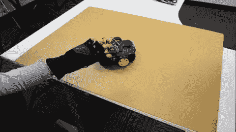

# 无线手势控制机器人

> 原文：<https://learn.sparkfun.com/tutorials/wireless-gesture-controlled-robot>

## 介绍

使用加速度计和 XBees 基于手的移动无线控制 RedBot！

### 所需材料

要跟随本教程，您将需要以下材料。你可能不需要所有的东西，这取决于你拥有什么。将它添加到您的购物车，通读指南，并根据需要调整购物车。