# 使用导线

> 原文：<https://learn.sparkfun.com/tutorials/working-with-wire>

## 介绍

当有人提到“电线”这个词时，他们很可能指的是一种柔性的圆柱形金属，其直径从几毫米到几厘米不等。Wire 既可以指机械应用，也可以指电气应用。机械线的一个例子可能是[绷线](http://en.wikipedia.org/wiki/Guy-wire)，但是本指南将集中于电气布线。

[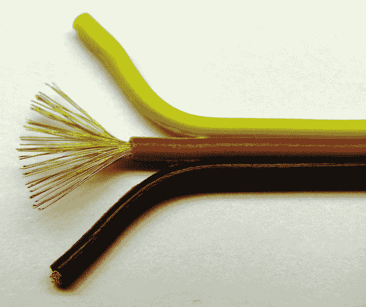](//cdn.sparkfun.com/assets/4/7/4/6/6/51155039ce395f2754000001.JPG)*Inside a stranded wire*

电线是我们社会的支柱。房子里有电线来开灯，加热炉子，甚至打电话。电线用来让[电流](https://learn.sparkfun.com/tutorials/voltage-current-resistance-and-ohms-law/current)从一个地方流到另一个地方。大多数电线的金属芯周围都有绝缘层。电绝缘体是一种内部电荷不能自由流动的材料，因此不导电。完美的绝缘体并不存在。然而，一些材料，如玻璃、纸和特氟隆，具有很高的电阻率，是非常好的电绝缘体。绝缘之所以存在，是因为接触裸线可能会让电流流过人体(不良)或无意中流入另一根电线。

### 推荐阅读

在阅读有关 wire 的内容之前，您可能需要探讨以下主题:

 [### 如何焊接:通孔焊接](https://learn.sparkfun.com/tutorials/how-to-solder-through-hole-soldering) This tutorial covers everything you need to know about through-hole soldering.[Favorited Favorite](# "Add to favorites") 70 [### 电压、电流、电阻和欧姆定律](https://learn.sparkfun.com/tutorials/voltage-current-resistance-and-ohms-law) Learn about Ohm's Law, one of the most fundamental equations in all electrical engineering.[Favorited Favorite](# "Add to favorites") 132 [### 公制前缀和国际单位制单位](https://learn.sparkfun.com/tutorials/metric-prefixes-and-si-units) This tutorial will explain how to use and convert between the standard metric prefixes.[Favorited Favorite](# "Add to favorites") 22

## 绞合线与实芯线

电线有两种形式:实心线或绞合线。

### 实心铁心

实芯焊丝由一根金属焊丝组成，也称为钢绞线。一种非常常见的实心线被称为[绕线](http://en.wikipedia.org/wiki/Wire_wrap)。

[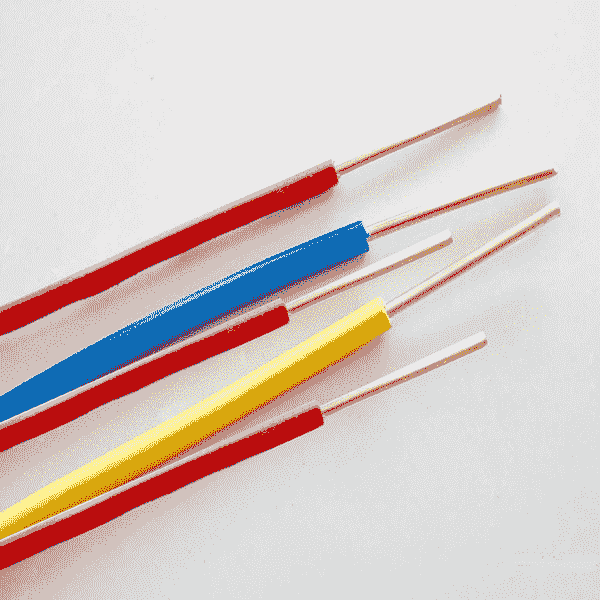](//cdn.sparkfun.com/assets/f/7/7/9/1/51155039ce395f6140000006.jpg)*Various colors of solid core wire*

### 绞合铁芯

多股绞合线是由许多股实心线捆扎成一组而成的。它比同样大小的实心金属丝更柔韧。

[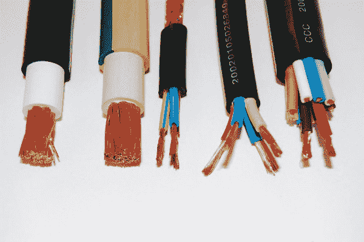](//cdn.sparkfun.com/assets/2/6/4/7/8/51155039ce395fe53f000006.jpg)*Various colors and sizes of stranded wire*

### 实心和绞合芯线的应用

由于绞合线比相同尺寸的实芯线更柔韧，因此可以在电线需要频繁移动时使用，例如在机器人手臂中。相反，当需要很少或不需要运动时，使用实心线，例如在[试验板或原型板](https://www.sparkfun.com/categories/301)上制作[电路](http://learn.sparkfun.com/tutorials/what-is-a-circuit)的原型。使用实芯导线使得将导线推入试验板和印刷电路板的电镀通孔变得容易。

| [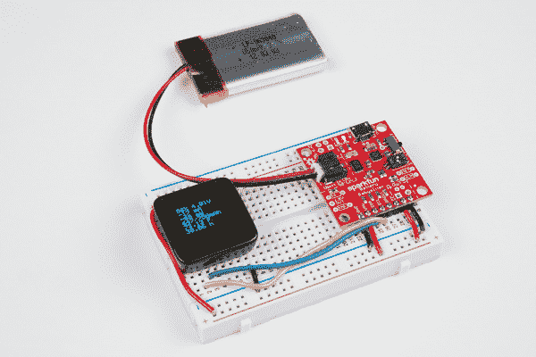](https://cdn.sparkfun.com/assets/learn_tutorials/5/3/0/babysitter-microview.jpg) | [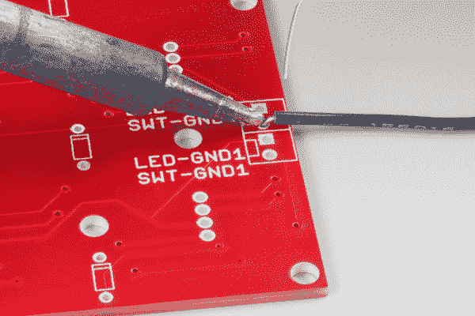](https://cdn.sparkfun.com/assets/learn_tutorials/4/6/2/4x4_RGB_Button_Pad_Hookup_Guide-21.jpg) |
| *实芯电线用于带[电池保姆](https://learn.sparkfun.com/tutorials/battery-babysitter-hookup-guide)的试验板* | *用[按钮垫分线板](https://learn.sparkfun.com/tutorials/button-pad-hookup-guide)将实芯线焊接到电镀通孔中* |

尝试在试验板或电镀通孔上使用绞合线可能非常困难，这取决于线的厚度，因为线在压入时会分离。

[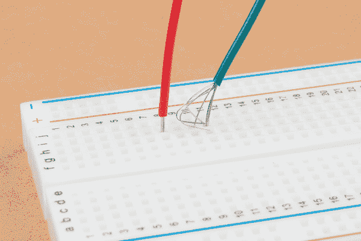](https://cdn.sparkfun.com/assets/learn_tutorials/4/1/Stranded_Core_Wire_in_BreadBoard.jpg)**Tip:** Trying to connect stranded wires to screw terminals, breadboards, or through holes? Try twisting the wire and tinning the tips. Below is an example with a stepper motor in the [Stepoko Hookup Guide](https://learn.sparkfun.com/tutorials/stepoko-powered-by-grbl-hookup-guide). The wire ends looking pretty ratty from the factory.

[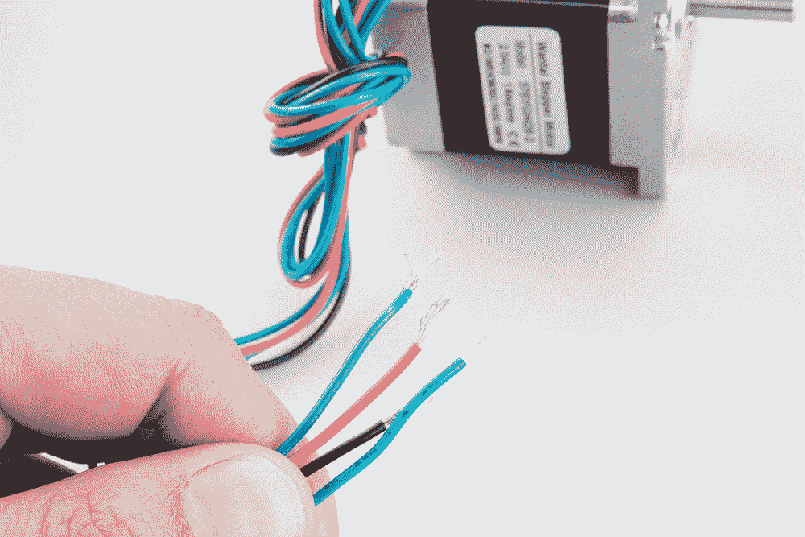](https://cdn.sparkfun.com/assets/learn_tutorials/4/1/4/Stepoko_Tutorial-01_showing_wires.jpg)

The image on the left shows the wire strands being twisted by giving them about 180 degrees of twist along the length of the strip. The image on the right shows the wires being tinned with soldered. Apply excess solder to allow the flux to work, and pull the extra solder off with the iron yielding a solid cylinder of wire.

|  | [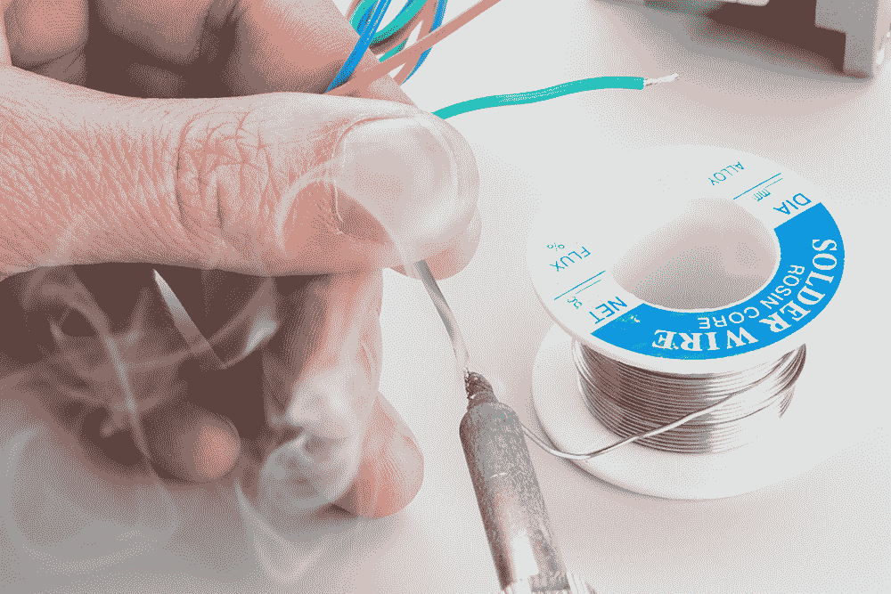](https://cdn.sparkfun.com/assets/learn_tutorials/4/1/4/Stepoko_Tutorial-04_tinning2.jpg) |

Keep in mind, that a soldered joint (of a tinned tip) can fracture under mechanical stress and thermal cycling may cause joint failure.

## 电线厚度

术语“规格”用于定义金属丝的直径。电线的规格用于确定电线可以安全处理的[电流](https://learn.sparkfun.com/tutorials/voltage-current-resistance-and-ohms-law/current)的大小。线规可以指电气的和机械的。本教程将只涵盖电气。轨距测量主要有两种系统，[美国线规(AWG)](http://en.wikipedia.org/wiki/American_wire_gauge) 和[标准线规(SWG)](http://en.wikipedia.org/wiki/Standard_Wire_Gauge) 。这两者之间的差异对于本指南来说并不重要。

[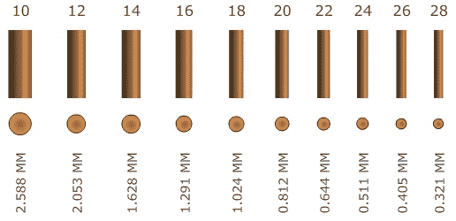](//cdn.sparkfun.com/assets/9/a/f/6/e/51155039ce395f0805000006.jpg)*An approximate scale of several different gauges of wire*

导线能够承载的电流量取决于几个不同的因素，例如导线的成分、导线长度和导线的状况。一般来说，较粗的电线可以承载更多的电流。

[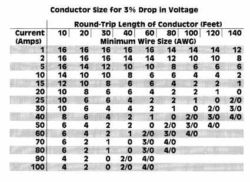](//cdn.sparkfun.com/assets/f/d/2/3/3/51155039ce395f5e3d000002.jpg)*An approximate wire thickness to current capability chart*

在 SparkFun，我们通常使用 **22 AWG** 线进行原型制作和试验。当使用试验板或 PCB 时，实心芯是完美的，因为它可以很好地嵌入孔中。对于其他涉及焊接的原型制作/构建，绞合芯是#1，只是要确保不要让太多的电流通过单条线。它会变热，可能会融化！

SparkFun 提供各种实心和绞合的 22 AWG 电线。

 

将**添加到您的[购物车](https://www.sparkfun.com/cart)中！**

### 

[In stock](https://learn.sparkfun.com/static/bubbles/ "in stock") PRT-11367

各种颜色的电线:你知道这是一个美丽的东西。六种不同颜色的硬纸板实芯焊丝…

$21.5037[Favorited Favorite](# "Add to favorites") 86[Wish List](# "Add to wish list")****[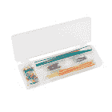](https://www.sparkfun.com/products/124) 

将**添加到您的[购物车](https://www.sparkfun.com/cart)中！**

### [跳线套件- 140pcs](https://www.sparkfun.com/products/124)

[In stock](https://learn.sparkfun.com/static/bubbles/ "in stock") PRT-00124

这是一个节省时间的 140 跳线套件-切割，剥离，预弯曲为您的原型乐趣。

$6.509[Favorited Favorite](# "Add to favorites") 58[Wish List](# "Add to wish list")**** 

将**添加到您的[购物车](https://www.sparkfun.com/cart)中！**

### 

[In stock](https://learn.sparkfun.com/static/bubbles/ "in stock") PRT-11375

各种颜色的电线:你知道这是一个美丽的东西。六种不同颜色的绞线装在一个纸板盒里…

$22.5019[Favorited Favorite](# "Add to favorites") 46[Wish List](# "Add to wish list")**** 

将**添加到您的[购物车](https://www.sparkfun.com/cart)中！**

### [大型跳线套件- 700pcs](https://www.sparkfun.com/products/14671)

[In stock](https://learn.sparkfun.com/static/bubbles/ "in stock") PRT-14671

这是一个节省时间的 700 跳线大套件-切割，剥离，并为您的原型乐趣预弯曲。

$26.952[Favorited Favorite](# "Add to favorites") 30[Wish List](# "Add to wish list")****************[Click to Browse More Wire Options!](https://www.sparkfun.com/categories/141)

但是，如果需要更小的尺寸，仍然可以选择使用 **30 AWG** 绕线。

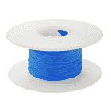 

### 线包电线-蓝色(实心，30AWG，100 英尺)

[Retired](https://learn.sparkfun.com/static/bubbles/ "Retired") PRT-14913

这是一卷 100 英尺长的蓝色绕线。这些电线是 30AWG 的实心线。

**Retired** 

### 线绕线-白色(实心，30AWG，100 英尺)

[Retired](https://learn.sparkfun.com/static/bubbles/ "Retired") PRT-14914

这是一卷 100 英尺长的白色绕线。这些电线是 30AWG 的实心线。

**Retired****Tip:** Wire wrap was first used to [build prototype circuits](http://en.wikipedia.org/wiki/Wire_wrap). In this day and age, it is much less common. However, it is still useful for connecting to small pins on a surface mount component or PCB, projects with small spaces, or repairing boards (i.e. "["Green" Wire Repairs](https://www.sparkfun.com/tutorials/99)).

| [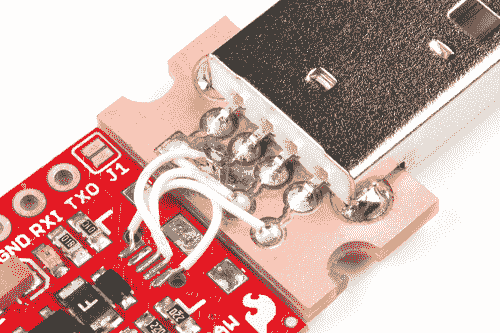](https://learn.sparkfun.com/tutorials/tech-prank-hardware-mouse-jiggler) | [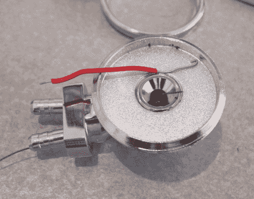](https://learn.sparkfun.com/tutorials/heartbeat-straight-jacket#hacking-a-stethoscope) | [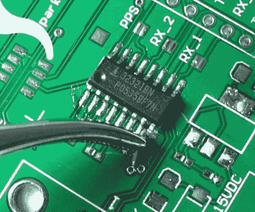](https://www.sparkfun.com/tutorials/99) |
| 连接到 PCB 小 SMD 引脚的绕线，这些引脚在[硬件鼠标摇动器](https://learn.sparkfun.com/tutorials/tech-prank-hardware-mouse-jiggler)上断开。 | 用于[心跳直护套](https://learn.sparkfun.com/tutorials/heartbeat-straight-jacket)空间小的项目中的绕线。 | [“绿色”线修复 PCB 设计不良或焊盘损坏的](https://www.sparkfun.com/tutorials/99)。 |

**Working with thick wire?** Wire wrap is also useful when splicing thick wire. For more information, check out the tutorial on [Building an Autonomouse Vehicle](https://learn.sparkfun.com/tutorials/building-an-autonomous-vehicle-the-batmobile/wire).

[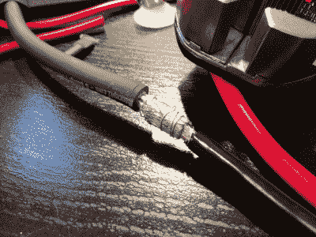](https://learn.sparkfun.com/tutorials/building-an-autonomous-vehicle-the-batmobile/wire)

## 如何剥开电线

安全、耐用的电气连接始于干净、准确的剥线。去除塑料外层而不划伤下面的电线至关重要。如果电线被划伤，连接可能会断开或发生短路。

[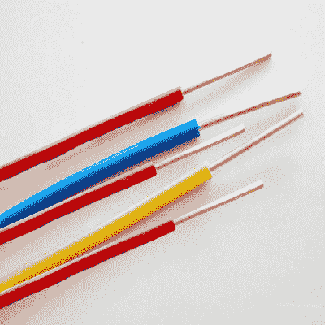](//cdn.sparkfun.com/assets/f/7/7/9/1/51155039ce395f6140000006.jpg)*No nicks or gouges. These wires have been properly stripped*

### 工具

#### 手动剥线器

简单的手动剥线钳[是一对相对的刀片，很像剪刀。有几个不同大小的缺口。这允许用户将凹槽尺寸与焊线尺寸相匹配，这对于不损坏焊线非常重要。根据制造商的不同，可能会有其他功能，包括锁定机构、符合人体工程学的手柄和切割螺钉的能力。](https://www.sparkfun.com/products/14763)

[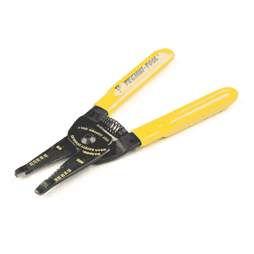](https://www.sparkfun.com/products/retired/14762) 

### [剥线钳- 22-30AWG](https://www.sparkfun.com/products/retired/14762)

[Retired](https://learn.sparkfun.com/static/bubbles/ "Retired") TOL-14762

这些是你的基本的，普通的剥线钳从 Techni-Tool 与舒适的抓地力，使他们成为一个负担得起的选择…

4 **Retired**[Favorited Favorite](# "Add to favorites") 8[Wish List](# "Add to wish list")[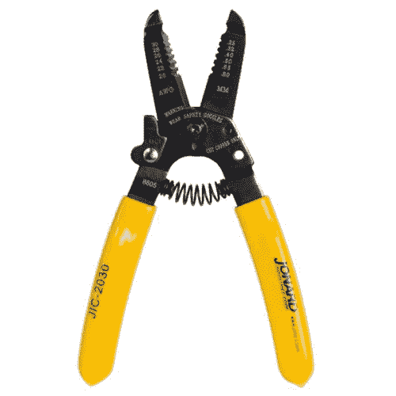](https://www.sparkfun.com/products/15220) 

将**添加到您的[购物车](https://www.sparkfun.com/cart)中！**

### [剥线钳- 20-30AWG](https://www.sparkfun.com/products/15220)

[In stock](https://learn.sparkfun.com/static/bubbles/ "in stock") TOL-15220

这些是 Jonard Industries 的高级剥线钳，具有舒适的弯曲手柄，是一种经济实惠的选择…

$11.951[Favorited Favorite](# "Add to favorites") 8[Wish List](# "Add to wish list")******Warning:** Many wire strippers found at the hardware store do not strip small gauge wire (22 to 30). When getting into prototyping, be sure to get a tool that is capable of stripping 22 AWG and smaller. Being able to strip very small 30 AWG wire (also known as wire wrap wire) is a plus.

虽然刀子也可以剥开电线，但它也可能会划伤或切入金属而损坏电线。用刀剥电线也真的很危险！刀子很容易打滑，造成严重伤害。

#### 自动调节剥线钳

也有自动调节的剥线器，通过在齿中间放置一根线并挤压手柄来自动剥线。这些几乎采取任何电线，并完美地剥离电线每一次。根据制造商的不同，可能包括切割或压接绝缘/非绝缘电线的附加功能。

[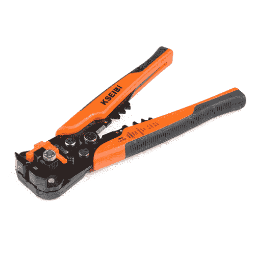](https://www.sparkfun.com/products/retired/14872) 

### [自动调节剥线钳](https://www.sparkfun.com/products/retired/14872)

[Retired](https://learn.sparkfun.com/static/bubbles/ "Retired") TOL-14872

自动调节的剥线器可以将电线放在工具的头部，压缩手柄，这样你就有了一个自动剥线器

2 **Retired**[Favorited Favorite](# "Add to favorites") 21[Wish List](# "Add to wish list")**Tip:** The self-adjusting wire stripper are also useful for removing sheaths from cables or stripping multiple insulated wires simultaneously.**Note:** We have found that the self adjusting wire stripper tool is very useful when modifying EL wire. Simply place the EL wire in the middle of the teeth and adjust the knob to reduce the grip on the wire. Make sure the corona wires are not directly under the teeth when stripping the wire.

>[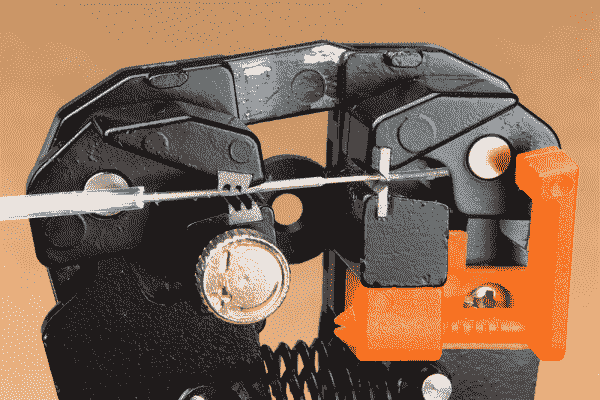](https://cdn.sparkfun.com/assets/learn_tutorials/7/9/9/Self-Adjusting-Wire-Stripper-EL-Electroluminescent_-Inner-Sheath-Removed.jpg)

#### 绕线工具

如果您使用绕线工具将导线绕在引脚上，中间可能已经有一个内置的剥离刀片来剥离细导线。只需将金属丝放在刀片之间，然后拉动。

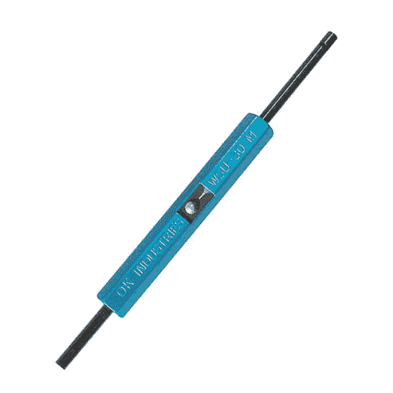 

### 绕线工具

[Retired](https://learn.sparkfun.com/static/bubbles/ "Retired") TOL-14915

这种绕线也可以用独特的内置剥离刀片来缠绕、解开甚至剥离适当直径的电线。

**Retired**

### 用手动剥线器剥线

通过简单地挤压手动剥线钳的手柄，使其距离电线末端约 1/4 英寸或所需长度，使用工具上的正确槽口，然后轻轻扭转，绝缘层将被切断。

[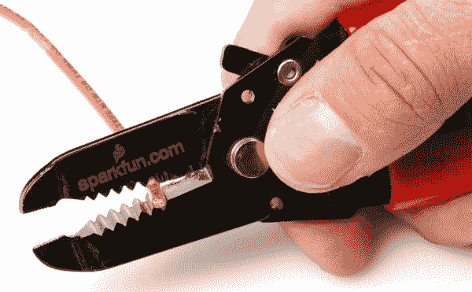](//cdn.sparkfun.com/assets/0/5/0/0/f/5138de3cce395fbb1b000002.JPG)

然后，将剥线钳拉向电线末端，绝缘层将从电线上滑落。

### 用自动调节剥线器剥电缆线

特殊的自动调节剥线器使得去除护套和剥多根绝缘线变得容易。在本例中，我们将剥电线电缆。将电缆末端放在工具的钢丝剪之间进行切割。准备就绪后，挤压手柄以切断电缆末端。

[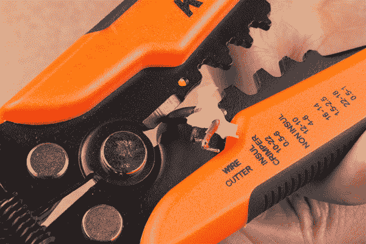](https://cdn.sparkfun.com/assets/learn_tutorials/4/1/Self-Adjusting-Wire-Stripper-Cutter.jpg)

将塑料导轨转离头部，并将其滑出，以调整要切割的焊线长度。当您对电线长度满意时，重新定位塑料导轨。对于电缆，您可能希望剥除比推荐指南更多的电缆。

[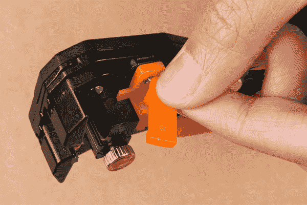](https://cdn.sparkfun.com/assets/learn_tutorials/4/1/Self-Adjusting-Wire-Stripper-Adjust-Strip-Length.jpg)

将电缆插入钳口之间。如有必要，根据电缆和电线尺寸，使用张力旋钮增加/减少夹钳的张力。

[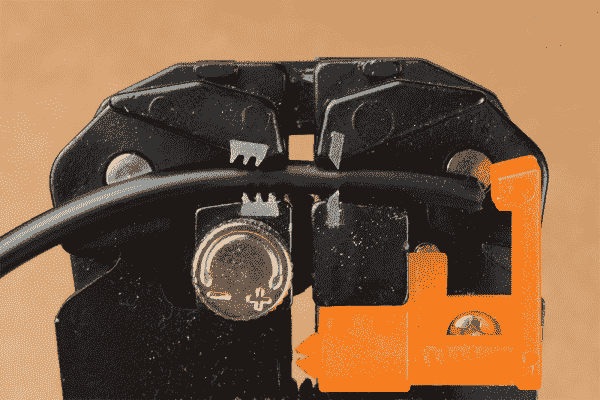](https://cdn.sparkfun.com/assets/learn_tutorials/4/1/Self-Adjusting-Wire-Stripper-Removing-Sheath.jpg)

在固定电缆的同时，挤压手柄，从电缆上剥下护套。

[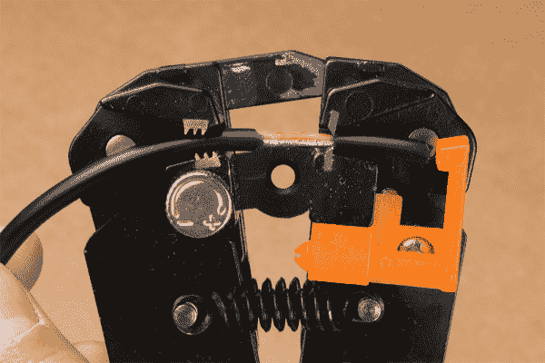](https://cdn.sparkfun.com/assets/learn_tutorials/4/1/Self-Adjusting-Wire-Stripper-Sheath-Stripped.jpg)

将金属片从电缆上滑下后，将内部电线放在齿间。根据电缆和电线尺寸，根据需要使用张力旋钮调节夹钳的张力。

[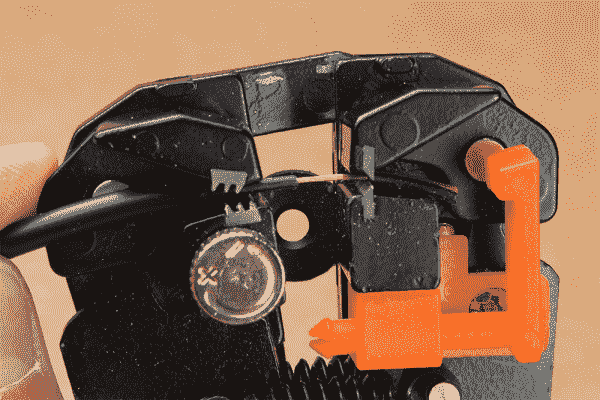](https://cdn.sparkfun.com/assets/learn_tutorials/4/1/Self-Adjusting-Wire-Stripper-Multiple-Wires.jpg)**Note:** Make sure to place the internal wires between the left jaw's teeth to strip the cable's wires.

完成后，你的电缆线应该是完美的剥离！

[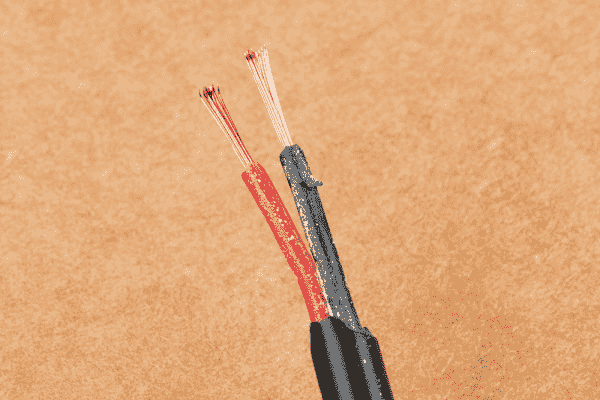](https://cdn.sparkfun.com/assets/learn_tutorials/4/1/Self-Adjusting-Wire-Stripper-Perfectly-Stripped.jpg)

### 技巧、诀窍和提示

将电线尺寸与剥离器中的正确槽口相匹配非常重要。如果切口太大，电线将不会被剥离。如果切口太小，有损坏电线的危险。使用尺寸过小的槽口意味着剥离器将关闭太远，挖到下面的电线。对于绞合线，该工具将切断线的外环，减小线的总直径并降低线的强度。实芯焊丝上的刻痕会严重降低焊丝的强度和柔韧性。线在弯曲时断裂的可能性显著增加。

[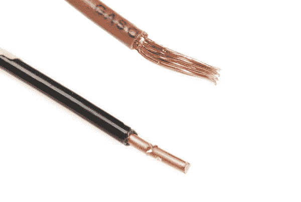](//cdn.sparkfun.com/assets/7/f/6/7/9/5138de3cce395f3c1d000001.JPG)*This wire was not stripped properly, there are gouges and missing strands*

如果一根电线不小心被划破了，最好的办法是把电线损坏的部分剪掉，然后再试一次。

## 如何拼接电线

使用剥线钳剥去电线末端，准备电线。如果你正在处理多股绞合线，试着在焊接前将线的两端绞在一起并在顶端镀锡。

[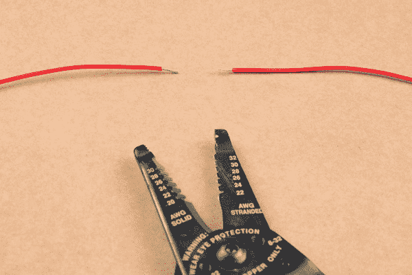](https://cdn.sparkfun.com/assets/learn_tutorials/4/1/Splicing_Wire-Strip_Wire.jpg)

剪一块热缩布盖住裸露的电线。将热缩管穿过其中一根电线。确保将热缩管滑离拼接区域。

[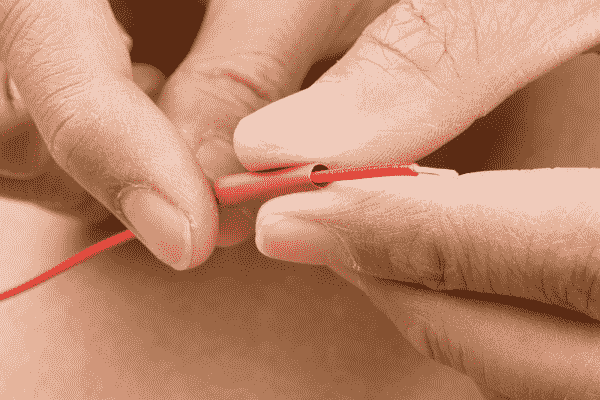](https://cdn.sparkfun.com/assets/learn_tutorials/4/1/Splicing_Wire-Adding_Heat_Shrink_Insulation.jpg)

将电线端子相互面对，并将裸露端接触在一起。

[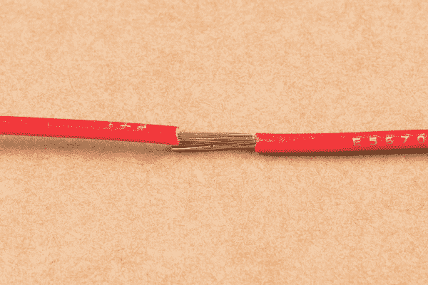](https://cdn.sparkfun.com/assets/learn_tutorials/4/1/Splicing_Wire-Align_Wire_Ends.jpg)

用胶带将导线固定在焊接垫上，将导线固定在一起。

[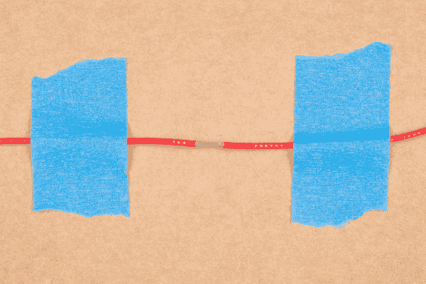](https://cdn.sparkfun.com/assets/learn_tutorials/4/1/Splicing_Wire-Hold_Wires_Down.jpg)**Tips:** Besides taping the wire down against a soldering mat, try using a [third hand](https://www.sparkfun.com/categories/377) or [3D printing clamps](https://www.sparkfun.com/news/2661) to hold the wires in place.

| [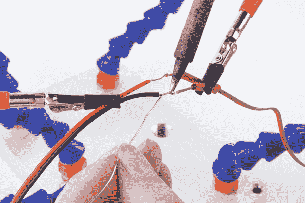](https://learn.sparkfun.com/tutorials/pokmon-go-patches-with-el-panels#adding-extension-cables) | [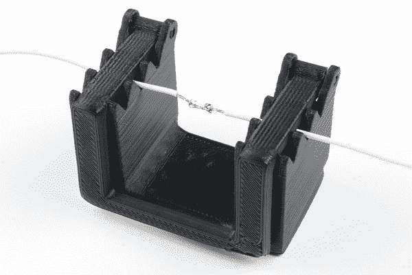](https://www.instagram.com/p/BVk6kPWlJJG/) |

给电线加焊料。尽量不要让烙铁在电线上停留太久。绝缘层会融化，露出更多的电线。

[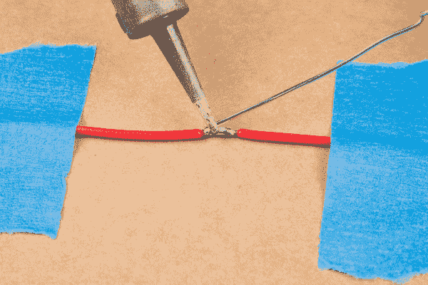](https://cdn.sparkfun.com/assets/learn_tutorials/4/1/Splicing_Wire-Solder_Wires.jpg)

确保电线的下侧也进行了焊接。

[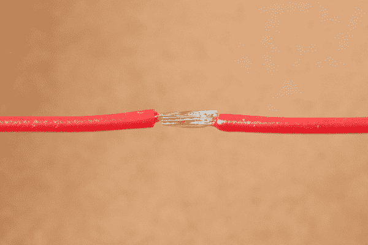](https://cdn.sparkfun.com/assets/learn_tutorials/4/1/Splicing_Wire-Solder_Wire_Ends_Thoroughly.jpg)

将电线翻转过来，将焊料涂在电线上。如有必要，添加助焊剂和焊料覆盖电线。

[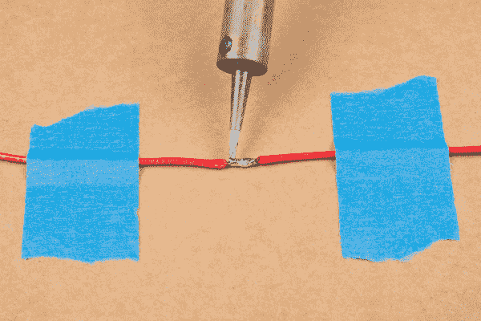](https://cdn.sparkfun.com/assets/learn_tutorials/4/1/Splicing_Wire-Solder_Wire_Ends.jpg)

如果使用热缩管，将热缩管滑到端子上，使连接绝缘。从烙铁或热空气返工站向热收缩层加热。

| [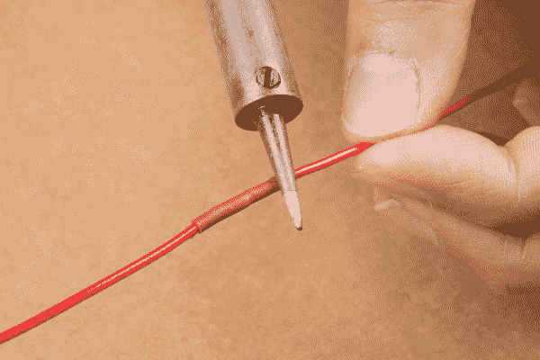](https://cdn.sparkfun.com/assets/learn_tutorials/4/1/Splicing_Wire-Heat_Shrink_Soldering_Iron_Wand.jpg) | [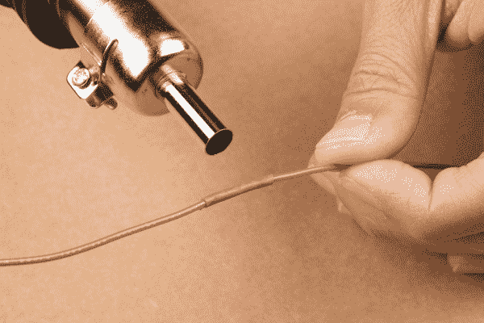](https://cdn.sparkfun.com/assets/learn_tutorials/4/1/Splicing_Wire-_Heat_Shrink_Hot_Air_Rework_Station.jpg) |
| *烙铁的热量* | *来自热风返工站的热量* |

完成后，热收缩应适合裸露的电线。

**Tips:** Looking for more ideas and methods of slicing wire? Try twisting the wires together. You can have the twisted wires [facing each other (a.k.a. twisted helix)](https://www.instagram.com/p/BAxjn_xDa09/) or [in the same direction](https://learn.sparkfun.com/tutorials/iot-weight-logging-scale#hardware-hookup).

[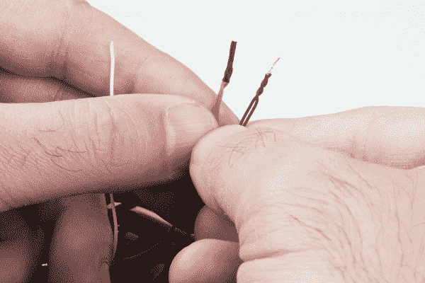](https://learn.sparkfun.com/tutorials/iot-weight-logging-scale#hardware-hookup)
You can also try hooking and twisting the wires together in a [Western Union splice (a.k.a. Lineman's Splice)](https://makezine.com/2012/02/28/how-to-splice-wire-to-nasa-standards/). This method is ideal for solid core wire but it can be used on stranded wires.

[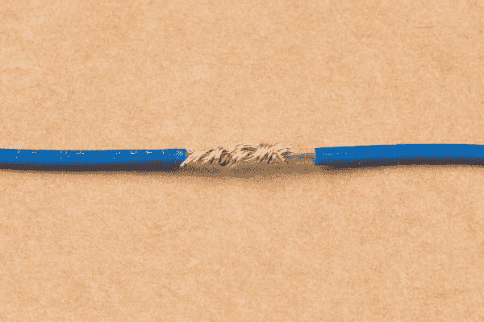](https://makezine.com/2012/02/28/how-to-splice-wire-to-nasa-standards/)
For advanced users, you could also tap into the wire for a [Western T-splice](https://en.wikipedia.org/wiki/T-splice) instead of cutting straight through wire. This is useful when adding a component(s) (i.e. a pull-up resistor) if you have a limited amount of space to work with to save time and reduce costs. Simply strip the middle of your wire, remove the insulation using a hobby knife/soldering iron, wrap a separate wire/terminal to the exposed wire, and solder. When finished, add some heat shrink or hot glue for insulation. The image below shows a resistor and wire being added to the middle of two wires.

[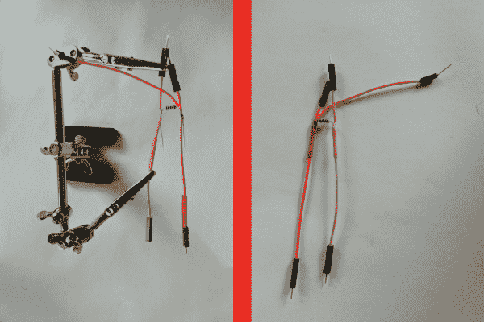](https://learn.sparkfun.com/tutorials/photon-remote-water-level-sensor#build-the-pump-controller)

*Western T-Splice Method Used to Connect 3 Jumper Wires and 10k&ohm; Resistor***Tip:** Having trouble splicing wires together or connecting wires to a pin? Try using a PCB as a support when soldering similar to the one built in the custom EL wire extension cable.

 [### 如何制作定制的 EL 电线延长线

#### 2018 年 10 月 24 日](https://learn.sparkfun.com/tutorials/how-to-make-a-custom-el-wire-extension-cable) In this tutorial, we will make a custom EL Wire extension cable as an alternative to splicing wire.[Favorited Favorite](# "Add to favorites") 4

## 如何压接电连接器

电连接器是一种使用机械组件将电路连接在一起的装置。这种连接可以是暂时的，也可以是两根电线之间的永久电连接。有数百种电连接器。连接器可以将两段电线连接在一起，或者将电线连接到电气端子上。

下面是一些连接器类型。在左上角，我们有一个**绝缘拼接连接器**将两个电线末端连接在一起。在右侧，**叉形连接器(又名铲子或开口环)**通过将叉子滑入螺丝端子的插座中，用于将电线连接到[螺丝端子。安装端子前，可以部分拧入螺钉。中间的**环形端子**也可用于连接电线和螺丝端子。虽然环形端子提供了更可靠的连接，但在安装端子之前，您需要完全卸下螺钉。在右上角，我们有一个**公铲连接器(又名刀片)**。这些可以滑入右下角所示的**凹形铲形连接器(又名双压接)**。根据设计和应用，这些连接器可以有不同的风格，如法兰叉或锁环终端。](https://cdn.sparkfun.com/assets/learn_tutorials/7/7/9/Insert_Hot_Wire_Spade_Connector_Between_Metal_Square_Nuts_1.jpg)

[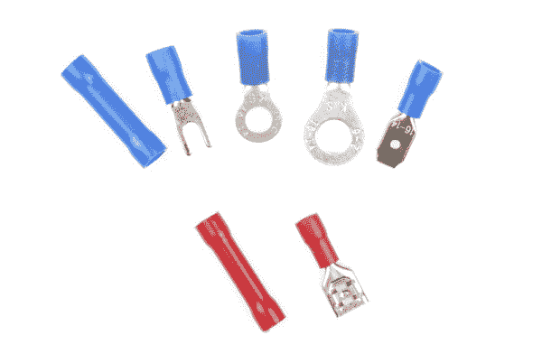](//cdn.sparkfun.com/assets/9/1/8/9/9/5138de3bce395f591d000000.JPG)*Insulated Splice, Forked, Ring, Male Spade and Female Spade Connectors*

这些连接器也可以有不同的尺寸和等级。下图显示的是一个 [1/4"](https://www.sparkfun.com/products/14407) 和 [2.8mm](https://www.sparkfun.com/products/14424) 母铲连接器。

为了安全连接，您需要匹配连接器的尺寸。下图显示了 1/4 "凹形扁平连接器连接到微动开关的凸形扁平端子。

[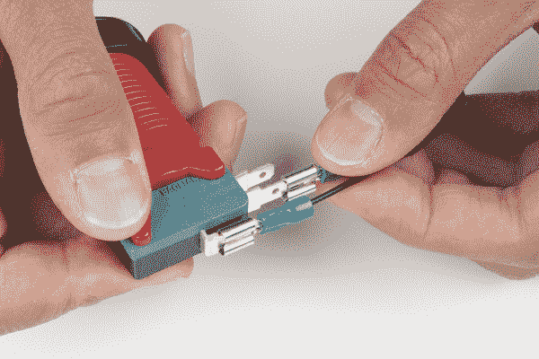](https://cdn.sparkfun.com/assets/learn_tutorials/6/4/5/Exp2_Step3Hookup.jpg)

### 什么是卷曲？

单词 [crimping](https://en.wikipedia.org/wiki/Crimp_(electrical)) 在上下文中的意思是通过使一个或两个金属变形来固定另一个，从而将两个金属连接在一起。这种变形被称为卷曲。

[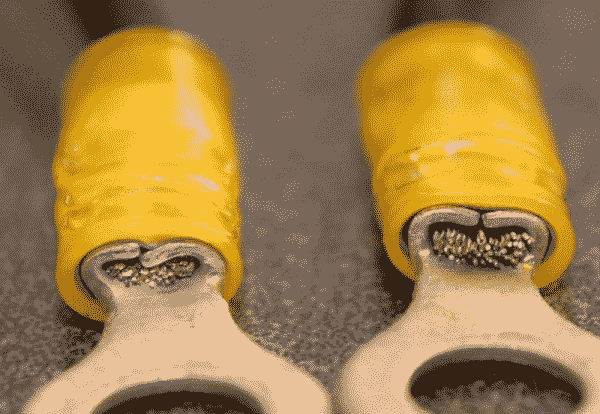](//cdn.sparkfun.com/assets/3/c/7/2/5/5138de3cce395f141b000000.jpg)*The metal has been deformed to pinch the wire and hold it in place*

### 该工具

为了将连接器压接到电线上，压接销需要专用工具。根据压接引脚的不同，有几种不同类型的压接器可供选择。

#### 棘轮压接工具

最好的压接钳有内置棘轮。当手柄被挤压在一起时，它将产生棘轮效应，防止钳口再次张开。当施加足够的压力时，棘轮将脱离并释放压接部分。这确保施加了足够的压力。这种类型的压接钳也有一个宽钳夹，以覆盖连接器上更多的表面区域。

[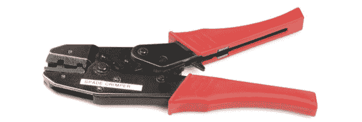](https://cdn.sparkfun.com/assets/learn_tutorials/4/1/Quick_Disconnect_Crimping_Tool_Ratchet.jpg)*Ratchet Crimp Tool for Quick Disconnectors*

根据连接器的尺寸，“模具”(即压接工具的头部)的类型会有不同的尺寸。下面的压接工具使用不同的模具来压接滑入引脚连接器外壳的较小压接引脚。

[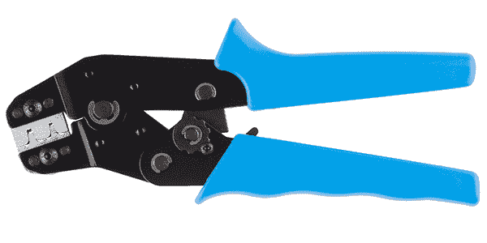](https://www.sparkfun.com/products/13193)*[Ratchet Crimp Tool](https://www.sparkfun.com/products/13193) for Crimp Pins*

下图显示了压接到叉形连接器的不同规格的导线和极化连接器的压接引脚。

| [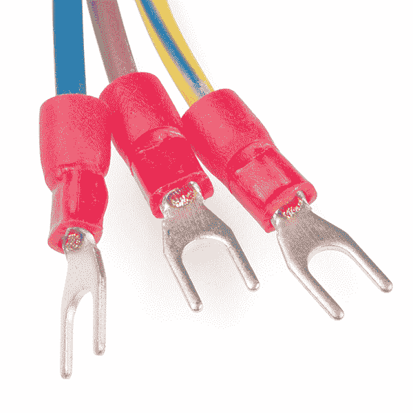](https://www.sparkfun.com/products/14093) | [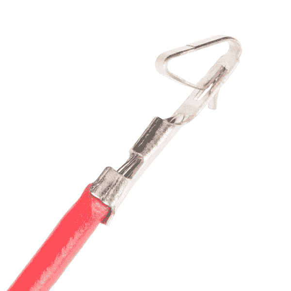](https://www.sparkfun.com/products/8100) |
| *为墙壁适配器压接的叉形连接器* | *压接销在插入塑料外壳前压接* |

#### 手动压接工具

手动压接工具可以达到几乎相同的效果，尽管它需要使用者更加警惕。这种类型的卷发器通常不太坚固。压接时必须注意确保钳口在连接器上正确对齐。未对准将导致不理想的压接连接。随着时间的推移，正常使用中的磨损也会导致钳口分离，不能完全闭合。一般来说，尽可能用力挤压就足够了。下图所示的花式剥线器可与快速断开装置一起使用。该工具也可用于切割电线和剥除电线/电缆。

[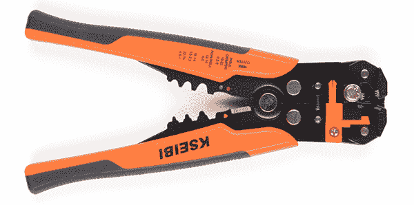](https://cdn.sparkfun.com/assets/learn_tutorials/4/1/14872-Self-Adjusting_Wire_Stripper_Crimper.jpg)*Manual Crimper on the [Self-Adjusting Wire Stripper](https://www.sparkfun.com/products/14872) for Insulated and Non-Insulated Spade Connectors*

虽然自调节剥线钳比棘轮更难使用，但它能够剥离、切割和卷曲快速断开装置。

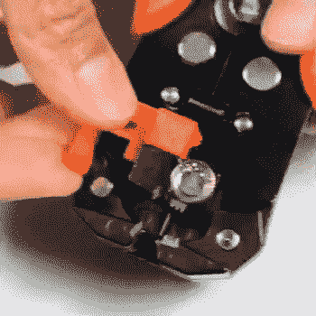**Warning!** Pliers are not crimpers! Neither are hammers, vises, needle nose pliers or flat rocks. A good crimper when used correctly will make a cold weld between the wire and the barrel of the connector. If you were to cut a well executed crimp in half you would see a solid form of wire and connector. Using the wrong tool will not achieve a good crimp!

[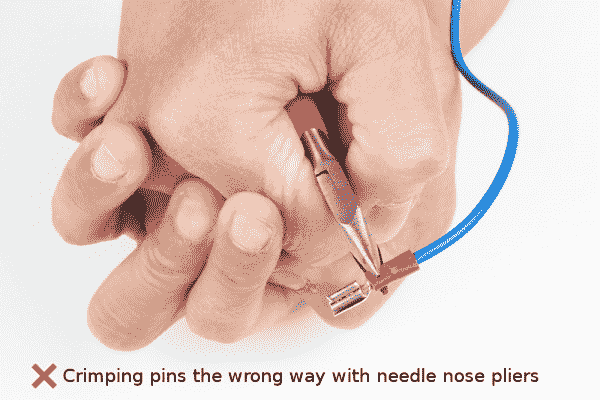](https://cdn.sparkfun.com/assets/learn_tutorials/4/1/Crimping_Pins_the_Wrong_Way_Pliers.jpg)
Why is this level of perfection required? A poor crimp leaves air pockets between the wire and connector. Air pockets allow moisture to collect, moisture causes corrosion, corrosion causes resistance, resistance causes heat, and may ultimately lead to breakage.

### 压接快速断开连接器

对于使用带压接的实芯导线，有几种赞成和反对的意见。许多人认为，压接实心导线会在导线中产生弱点，从而导致断裂。压接接头与实芯电线松脱的可能性也更大，因为电线也不符合端子。如果你*必须*使用实芯电线，在压接电线后[将电线](https://learn.sparkfun.com/tutorials/how-to-solder-through-hole-soldering)焊接到位是个好主意。

首先，必须为端子尺寸选择正确尺寸的电线，反之亦然。我们将假设您使用的是绞合线，以便电线符合压接连接。接下来，剥去电线。外露电线的数量应等于连接器上金属筒的长度，通常在“左右。如果剥开的电线与桶的金属部分吻合，只有很少或没有自由空间，则连接器的尺寸是正确的。

[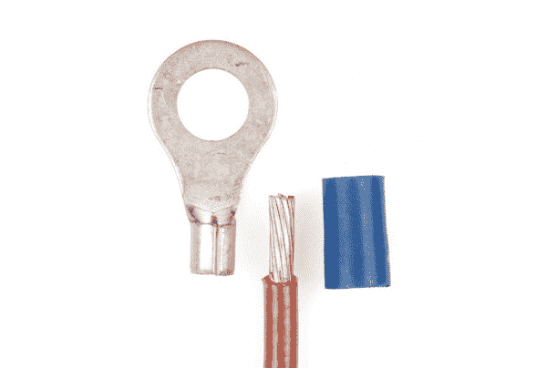](//cdn.sparkfun.com/assets/9/4/b/0/f/51390134ce395f091b000001.jpg)*A good length of wire to barrel ratio*

然后应插入导线，直到导线上的绝缘层接触到筒体的末端。

[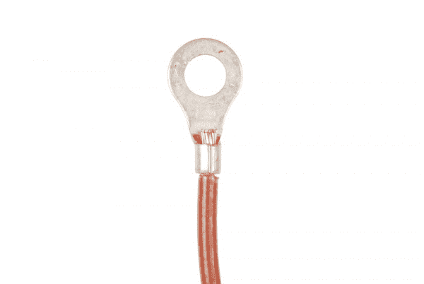](//cdn.sparkfun.com/assets/2/0/1/0/5/5138de3cce395f5a18000001.jpg)*Good: The wire is sticking past the barrel just a little*

然后将电线和端子插入压接钳。端子绝缘层的颜色需要与压接工具上的颜色一致。因此，如果端子的绝缘是红色的，使用压接器上红点标记的点。或者，如果压接钳没有颜色标记，使用侧面的仪表标记。

终端应水平放置，桶侧朝上。然后，将工具垂直于端子放置在筒体上，最靠近环(或其他连接类型)。为了完成压接，用相当大的力挤压工具。一般来说，几乎不可能“过度压接”接头。

**Heads up!** Check out the post from Hacakday for more information on crimping, a cross section of a crimped wire, and a video!

[Hackaday | Good in a Pinch: The Physics of Crimped Connections](https://hackaday.com/2017/02/09/good-in-a-pinch-the-physics-of-crimped-connections/)
For a detailed examples of good and bad crimped pin, check out the following from JST!

[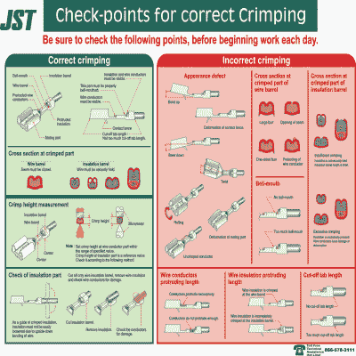](https://cdn.sparkfun.com/assets/learn_tutorials/4/1/JST_CrimpChart__English_.pdf)

*Click on image for closer view.*

压接完成后，用很大的力将导线和连接器拉开后，它们仍应保持在一起。如果可以拉开连接，则压接不正确。最好现在就让压接失效，而不是在压接应用中安装之后。下面是用于压接连接的军用规格表。

[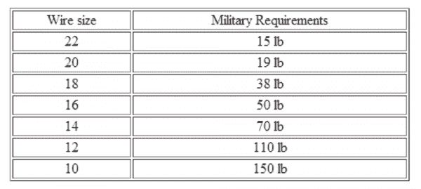](//cdn.sparkfun.com/assets/0/3/6/6/6/5138de3cce395fbe1a000000.png)**Tip:** If the wire does not fit in the barrel, or is excessively loose, the wrong size and type of either wire or connector was chosen. If necessary, you could add a solder joint between the wire and connector. However, wires that are crimped properly will create a gas tight, cold joint and should not need solder.

[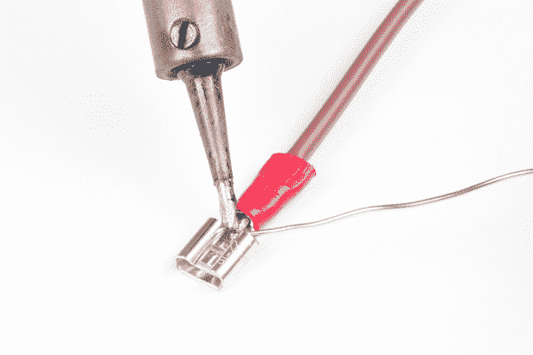](https://cdn.sparkfun.com/assets/learn_tutorials/4/1/Soldering_Wire_to_Quick_Disconnect.jpg)
Keep in mind, that adding solder will add stress to the joint due to mechanical vibrations and thermal cycling causing joint failure. Soldering can also increase resistance at the joint. For low power applications, users should not notice a significant difference.**Tip:** Depending on the application, two wires can be crimped with together in a single crimp connector. You'll need to ensure that the combined wire diameter is able to fit in the crimp connection and the crimp connector is able to handle the amperage of the project.

The image below demonstrates two wires crimped with female spade headers for the middle connections. In this case, the crimped wires were used to connect multiple devices to ground.

[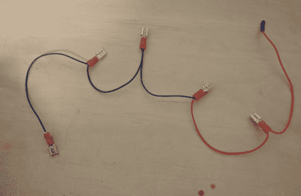](https://cdn.sparkfun.com/assets/learn_tutorials/4/1/Crimping_Multiple_Wires_Crimp_Terminal.jpg)

### [压接一个压接销](#crimp-pin)

请记住，世界上有数百种类型的电连接器。根据设计，连接器可以设计成适合塑料外壳。连接器可以包括两个压接片(即翼片)来压接电线及其绝缘层，而不是压接在电线上的圆筒。额外的绝缘压接片可消除应力。当压接销插入塑料外壳中时，压接销还可以具有锁定凸片和终端挡块。

| [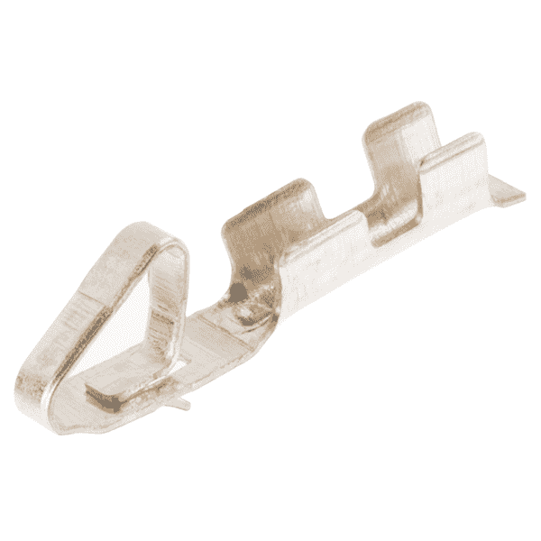](https://www.sparkfun.com/products/8100) |  |
| *压接从极化连接器卷轴上切下的引脚* | *极化连接器的塑料外壳* |

预端接优质跳线就是一个例子。它们用于连接设计有 0.1 英寸 PTH 焊盘的 PCB。下图是几个压接引脚在插入塑料外壳之前的图像。左边是一个压接针，用于安装在极化外壳内。中间是一个母针，用来与右边的公针配合。

[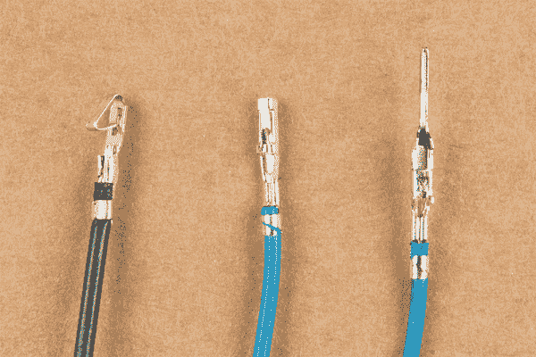](https://cdn.sparkfun.com/assets/learn_tutorials/4/1/Different-Crimped_-Pin-Heads.jpg)

这个过程有点繁琐，因为你用的是更小的针。根据你的经验水平，这可能很费时间。但是，用户可以为项目创建自定义导线长度和电缆。

首先，切断并剥去一段电线。确保线径与压接销的规格相匹配。在这种情况下，我们将使用 22 AWG 绞合连接导线连接到压接销数据表推荐的 [JST RCY 连接器](https://www.sparkfun.com/products/10501)。从金属条上取下压接销后，将导线束对准导电接头，将绝缘体对准绝缘体接头，检查导线是否符合压接销的规格。

[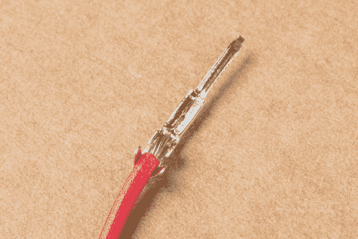](https://cdn.sparkfun.com/assets/learn_tutorials/4/1/Crimp-Pin-Stranded-Wire.jpg)

如果导线剥离充分，将压接销插入压接工具的一个钳口中。你可能需要向内弯曲绝缘体的凸片来配合。我们会用更大的下巴。

[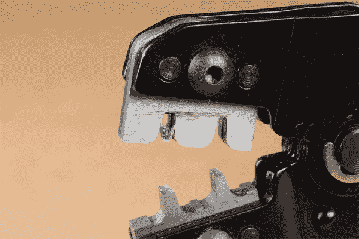](https://cdn.sparkfun.com/assets/learn_tutorials/4/1/Insert-Crimp-Pin-Die.jpg)

将压接销插入模具时，确保注意压接工具的凹槽。如果你仔细观察，在下颚的一侧有两个半圆柱形的凹槽，而另一侧有一个凹槽。有两个凹槽的一侧将用于压接凸耳。此外，模具的一半是凹进的，用于绝缘体凸片。

| [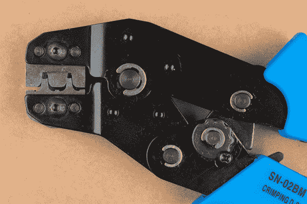](https://cdn.sparkfun.com/assets/learn_tutorials/4/1/Ratcheted-Crimper-Closed-Tool-Die.jpg) | [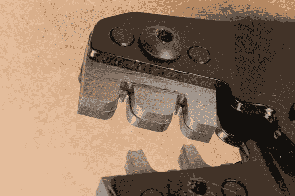](https://cdn.sparkfun.com/assets/learn_tutorials/4/1/Ratcheted-Crimper-Tool-Die-Close-Up.jpg) |
| *棘齿压接工具的侧视图* | *带有两个凹槽的压接工具的特写镜头，模具凹进绝缘体接线片* |

**Warning!** If you insert a crimp pin incorrectly, the ratcheted crimp tool will not sufficiently crimp the tabs. As a result, the wire may not fully conduct with the pin and the pin will be damaged. The crimp tool can also get stuck in one position. If the crimp tool is stuck, you will need to flip the safety release pin just above the handle.

[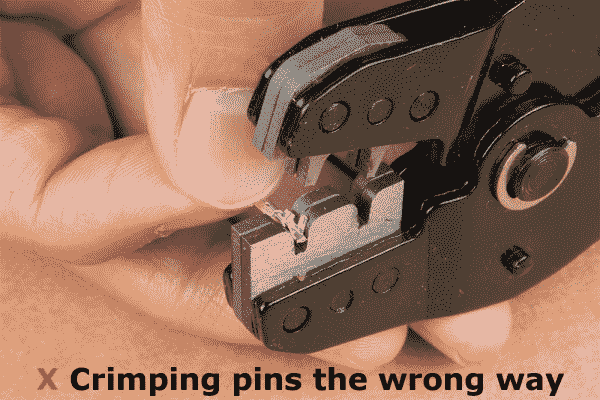](https://cdn.sparkfun.com/assets/learn_tutorials/4/1/Crimping-Pins-the-Wrong-Way.jpg)

慢慢关闭棘齿压接工具，将压接销固定到位，并插入剥开的电线。您可能需要调整压接引脚，使其绝缘片与芯片齐平。

[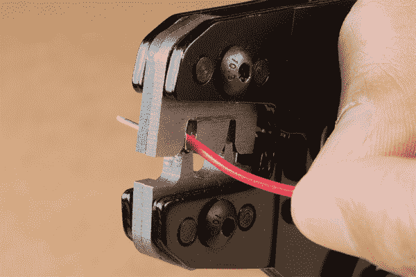](https://cdn.sparkfun.com/assets/learn_tutorials/4/1/Crimp-Tool-Partially-Closed-Crimp-Pin-Stripped-Wire.jpg)

准备就绪后，慢慢挤压手柄，继续卷曲凸耳。如果有什么不对劲，并且您正在使用棘轮压接工具，请翻转手柄上方的安全释放销。继续挤压手柄，直到棘轮自动松开，完成压接。

[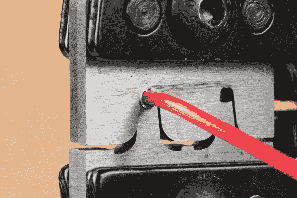](https://cdn.sparkfun.com/assets/learn_tutorials/4/1/Crimping-Pin-Wire.jpg)

小心地将压接销从压接工具中取出。观察卷曲的凸舌。您应该会看到类似下面的卷曲引脚。如有必要，您可能需要将销重新插入钳夹，以充分压紧凸耳。最左边的压接销部分压接，需要放在较小的钳口中，以便正确压接。

准备就绪后，将压接销插入其各自的外壳。在这种情况下，卷曲的母插脚被插入其各自的 JST RCY 连接器外壳。确保锁片与塑料外壳上的孔相匹配。

[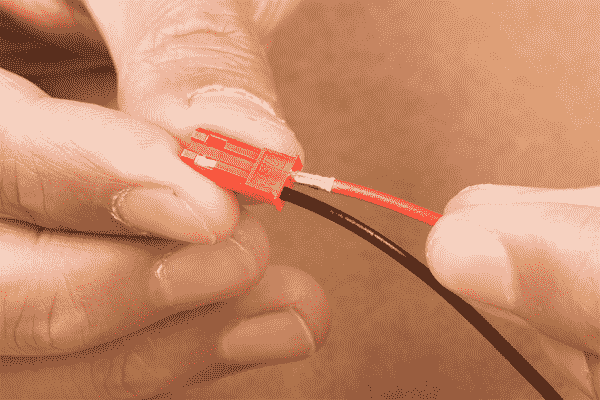](https://cdn.sparkfun.com/assets/learn_tutorials/4/1/Crimped-Pin-Inserted-Into-Plastic-Housing.jpg)

完成后，电线应卡入各自的外壳。下面是它们各自外壳中的一些卷曲引脚。在最左边，我们有用于极化 1 x2“Molex”连接器的压接引脚。右边带有黑色外壳的两个是与[标准 0.1 "接头](https://learn.sparkfun.com/tutorials/connector-basics#pin-header-connectors)一起使用的压接引脚示例。最后，红色外壳中的压接引脚用于 JST RCY 连接器。

[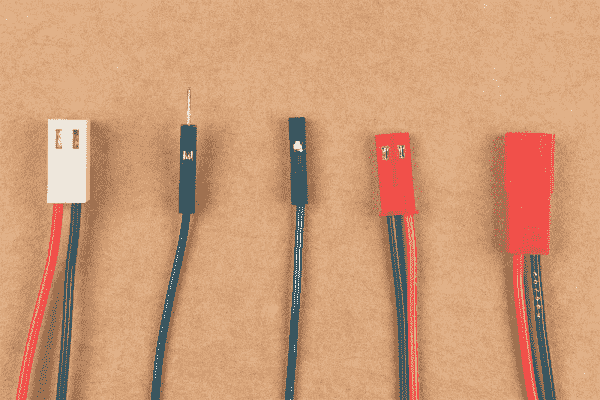](https://cdn.sparkfun.com/assets/learn_tutorials/4/1/Crimped-Pins-Different-Plastic-Housing.jpg)

### 常见的事故

以下是压接快速断开装置和压接销时的常见错误列表。我们将使用快速断开进行演示。

导线的连接器尺寸错误或连接器的导线尺寸错误。

[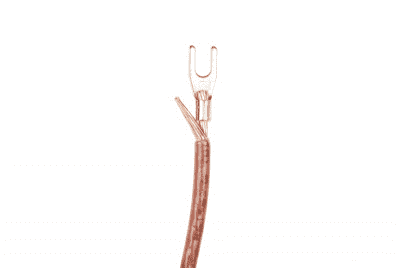](//cdn.sparkfun.com/assets/0/6/1/e/1/5138de3cce395fdf1a000000.jpg)*Bad crimp. Connector was too small for the gauge of wire chosen.*

小心不要剥去太多绝缘材料。

[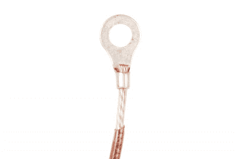](//cdn.sparkfun.com/assets/9/4/c/1/7/5138de3bce395f161a000001.jpg)*Too much insulation has been stripped off, too much bare wire exposed*

还值得一提的是，虽然不一定有害，但电线不应伸出枪管太远。如果发生这种情况，建议修剪电线。

[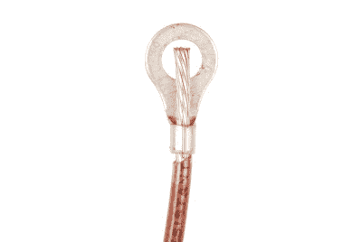](//cdn.sparkfun.com/assets/2/6/b/d/7/5138de3cce395f401a000001.jpg)*The excess bare wire should be trimmed off*

## 如何使用绕线工具

**Caution!** Remember, wire wrap uses a small gauge. While this is perfect for projects that do not have a lot of room to work with, it is not able to handle a lot of power due to the thickness of the wire.

将 30 AWG 电线插入绕线工具的刀片之间，剥去电线。拉动电线，去除绝缘层。

[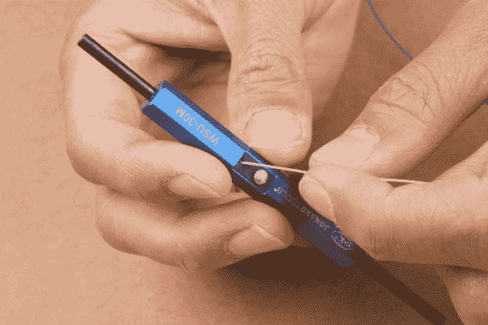](https://cdn.sparkfun.com/assets/learn_tutorials/4/1/Wire_Wrap_Tool_Strip_30AWG.jpg)

确保剥去足够多的电线，缠绕在端子上，以实现充分连接。大约 1 英寸应该足够了。

[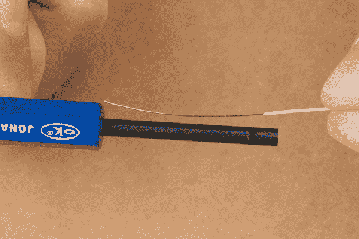](https://cdn.sparkfun.com/assets/learn_tutorials/4/1/Wire_Wrap_Tool_1_Inch.jpg)

将裸露的电线沿侧面插入孔中。确保将电线插在有凹口的一侧，并将电线放在沿圆柱体一侧的切口中。

| [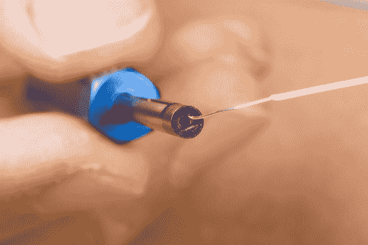](https://cdn.sparkfun.com/assets/learn_tutorials/4/1/Insert_Wire_Into_Wire_Wrap_Tool.jpg) | [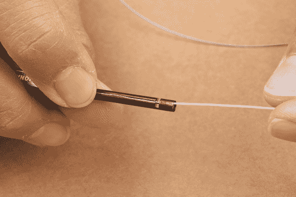](https://cdn.sparkfun.com/assets/learn_tutorials/4/1/Lay_Wire_Along_Groove_Wire_Wrap_Tool.jpg) |

将电线插入接头销(又名接线柱)。在这种情况下，[公头引脚](https://www.sparkfun.com/products/12693)用于小型试验板上。

[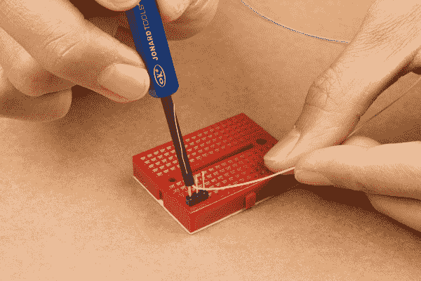](https://cdn.sparkfun.com/assets/learn_tutorials/4/1/Insert_Wire_Wrap_Tool_Header_Post.jpg)**Note:** Stackable female header pins can twist with the wire wrap tool and wire. It is recommended that you wrap wire around [male header pins](https://www.sparkfun.com/products/116).

顺时针旋转工具，开始将导线缠绕在方形接头销上。用另一只手按住电线和接头销。继续旋转工具，使所有剥开的电线缠绕在销上。

[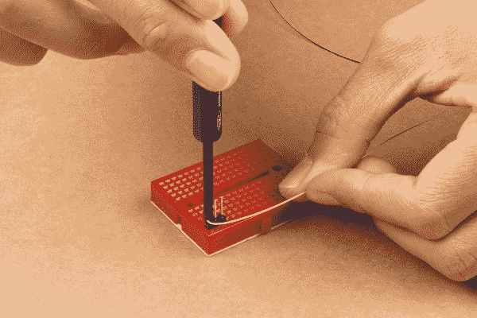](https://cdn.sparkfun.com/assets/learn_tutorials/4/1/Twist_Wire_Wrap_Tool.jpg)

从销上取下工具。完成后，电线的绝缘应该从引脚的底部开始。为了更加持久和安全的连接，[在电线和引脚](https://www.instagram.com/p/60Hx9DDa0r/)之间添加一些焊料。

| [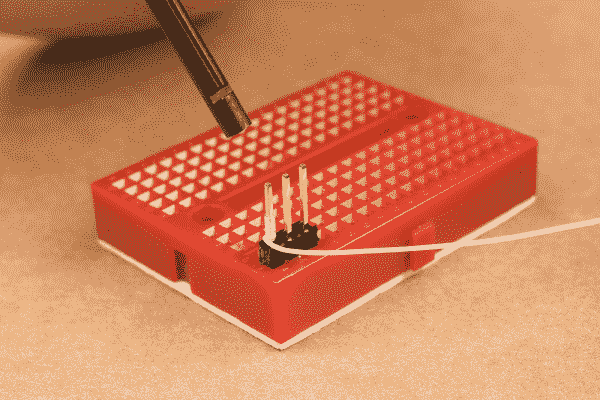](https://cdn.sparkfun.com/assets/learn_tutorials/4/1/Remove_Wire_Wrap_Tool.jpg) | [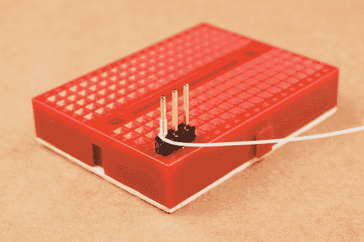](https://cdn.sparkfun.com/assets/learn_tutorials/4/1/30_AWG_Wrapped_Around_Header.jpg) |

如果您需要在同一个引脚上进行更多连接，请在第一个连接的顶部缠绕更多电线，并重复上述步骤。您可以堆叠的数量取决于收割台引脚的长度。尝试使用绕线工具将导线绕在微控制器、LED 或电阻器的接头上，以进行原型制作。

| [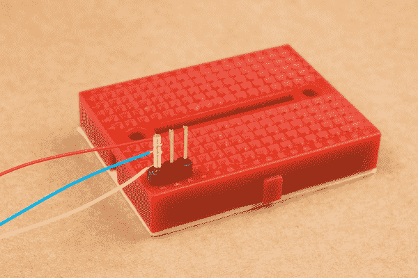](https://cdn.sparkfun.com/assets/learn_tutorials/4/1/Stacking_Wire_Wraps.jpg) | [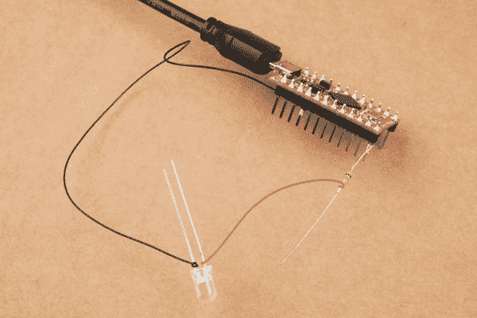](https://cdn.sparkfun.com/assets/learn_tutorials/4/1/Wire_Wrap_Arduino_LED_Terminals.jpg) |

### 拆卸缠绕的电线

如果您需要断开电线与引脚的连接，只需使用工具的另一端，逆时针旋转即可。

| [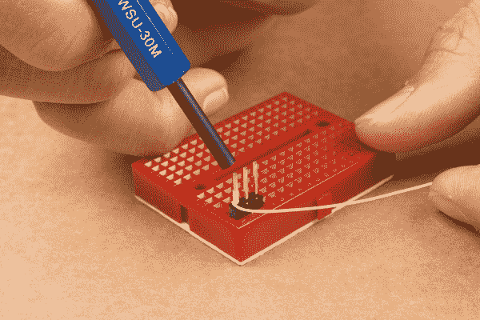](https://cdn.sparkfun.com/assets/learn_tutorials/4/1/Removing_Installed_Wire_Wrap.jpg) | [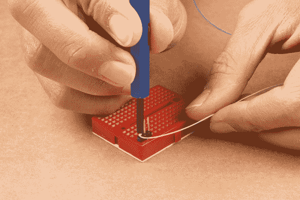](https://cdn.sparkfun.com/assets/learn_tutorials/4/1/Twist_Wire_Wrap_Tool_Remove.jpg) |

一旦松开绕线，将电线从销上拉开。

[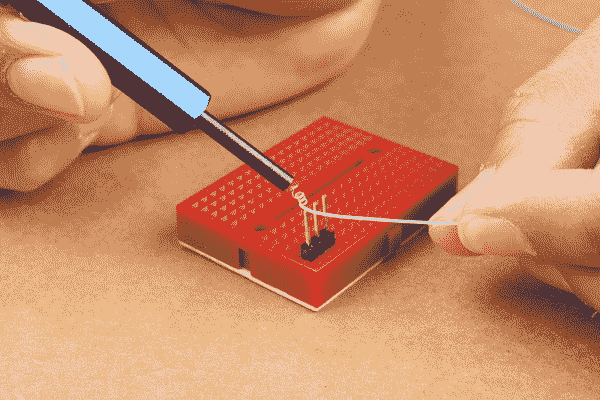](https://cdn.sparkfun.com/assets/learn_tutorials/4/1/Wire_Wrap_Removed.jpg)**Note:** For more information about wire wrapping, types of wrapping, and tips, check out the article from [Nuts and Volts: Wire Wrap is Alive and Well!](http://www.nutsvolts.com/magazine/article/wire_wrap_is_alive_and_well)

## 电线管理

### 将电线拧成一条辫子

编织项目中使用的长电线是一个好主意。将电线缠绕在一起有几个好处:

*   保持项目有条理
*   防止电线从移动部件中拉出
*   加强联系

**Note:** The following was inspired by [McCall’s tutorial](http://diyaudioprojects.com/Power/Low-Inductance-DIY-Speaker-Cables/) when completing projects.

下面是一个非寻址 LED 的四根连接线编织在一起的例子。要编织电线，用双手将一对电线逆时针拧在食指和拇指之间。在这种情况下，绿色和红色电线首先被扭曲。

[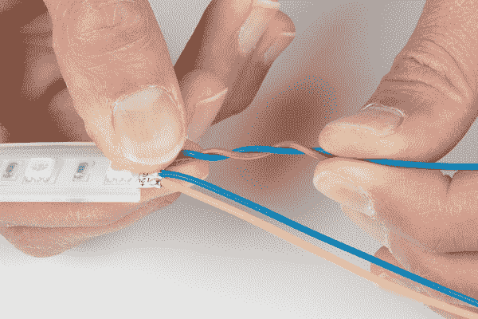](https://cdn.sparkfun.com/assets/learn_tutorials/4/6/4/WireManagementBraidingCounterclockwise_1.jpg)

以逆时针方式缠绕另一对导线。

[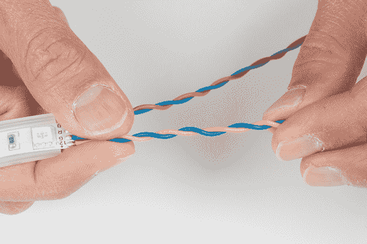](https://cdn.sparkfun.com/assets/learn_tutorials/4/6/4/WireManagementBraidingCounterclockwise_2.jpg)

按顺时针方向缠绕导线对。

[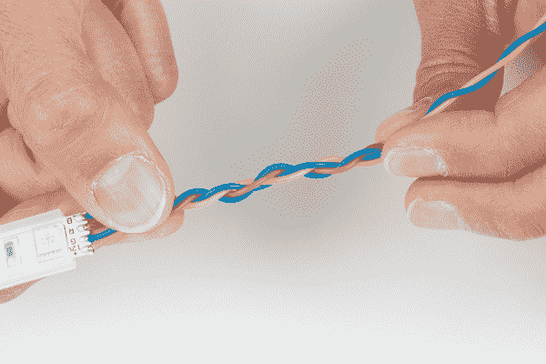](https://cdn.sparkfun.com/assets/learn_tutorials/4/6/4/WireManagementBraidingClockwise.jpg)

完成后，项目中的电线将易于管理和处理。下面是几个项目中使用编织线的例子。

| [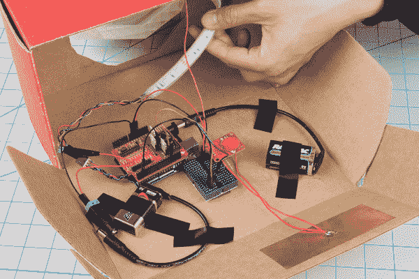](https://cdn.sparkfun.com/assets/learn_tutorials/7/6/2/3D_Printed_Diamond_Prop_Circuit_in_Enclosure.jpg) | [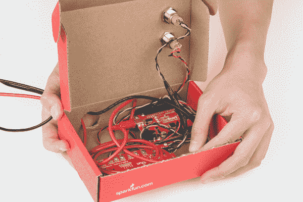](https://cdn.sparkfun.com/assets/learn_tutorials/4/6/1/Wireless_Bluetooth_Speaker_Project-11.jpg) |
| *在[互动 3D 打印 LED 钻石道具教程](https://learn.sparkfun.com/tutorials/interactive-3d-printed-led-diamond-prop)中使用的一些扭曲的电线* | *使用在[无线音频蓝牙适配器 w/ BC127 教程](https://learn.sparkfun.com/tutorials/wireless-audio-bluetooth-adapter-w-bc127)中的绞线* |

**Tip:** Try using a [power drill to twist long wires together.]( https://www.instagram.com/p/7GJ2kuja8D/)

### 套管和电缆托架

套管和[电缆托架](https://www.sparkfun.com/products/13207)也有助于进一步保护可移动部件的连接。下图显示了 Shapeoko 上松动的电线。

[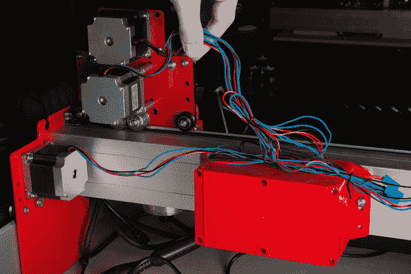](https://cdn.sparkfun.com/assets/learn_tutorials/4/5/6/Shapeoko_Tutorial-35.jpg)

下图是用于保护的套管和电缆托架内的电线。

| [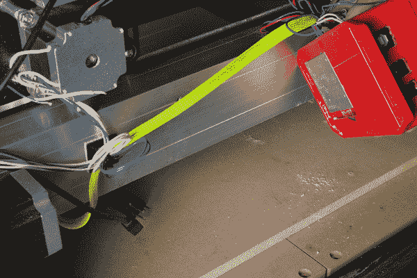](https://cdn.sparkfun.com/assets/learn_tutorials/4/1/4/Stepoko_Tutorial-15_heatsinkchassis.jpg) | [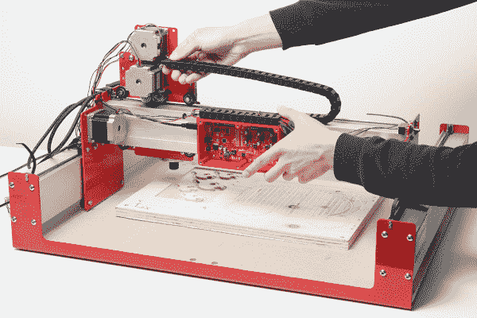](https://cdn.sparkfun.com/assets/learn_tutorials/5/0/6/Shapeoko_Update-09.jpg) |

### 标记复杂布线

有时，使用便笺、胶带或标记来标记导线很有用，有助于跟踪使用相同颜色导线的连接、复杂布线以及对项目进行故障排除。

*Labeled wires from the [micro:arcade kit](https://learn.sparkfun.com/tutorials/microarcade-kit-experiment-guide/experiment-3-fun-with-the-joystick)***Tips:** Check out the links below for more ideas.

*   *可印刷收缩管* -尝试使用[可印刷热缩管](https://www.instagram.com/p/BZ16ObuBiWL/?utm_source=ig_web_copy_link)给电线贴标签。
*   *标记* -另一个选项是[用标记](https://www.instagram.com/p/78JSoLDazZ/?taken-by=sparkfun)标记焊线末端。

## 资源和更进一步

你现在应该熟悉电线，知道它在电子世界中有多有用。无论你是在制作原型、返工还是制造最终产品，电线都是你最好的朋友。这里有一些其他教程，你可以探索涉及电线。

*   创建自己的[电路](/what-is-a-circuit)时，电线是最基本的元素。
*   不确定电线应使用哪种连接器？查看[连接器基础知识](http://learn.sparkfun.com/tutorials/connector-basics)以获得您需要的东西！
*   想开始原型制作吗？查看[试验板](https://learn.sparkfun.com/tutorials/how-to-use-a-breadboard)开始行动吧！
*   希望您的联系更加灵活？尝试在你的可穿戴项目中使用[导电线](https://learn.sparkfun.com/tutorials/lilypad-basics-e-sewing)！

 [### 连接器基础](https://learn.sparkfun.com/tutorials/connector-basics) Connectors are a major source of confusion for people just beginning electronics. The number of different options, terms, and names of connectors can make selecting one, or finding the one you need, daunting. This article will help you get a jump on the world of connectors.[Favorited Favorite](# "Add to favorites") 62 [### 什么是电路？](https://learn.sparkfun.com/tutorials/what-is-a-circuit) Every electrical project starts with a circuit. Don't know what a circuit is? We're here to help.[Favorited Favorite](# "Add to favorites") 82 [### 如何使用试验板](https://learn.sparkfun.com/tutorials/how-to-use-a-breadboard) Welcome to the wonderful world of breadboards. Here we will learn what a breadboard is and how to use one to build your very first circuit.[Favorited Favorite](# "Add to favorites") 79 [### LilyPad 基础:电子缝纫](https://learn.sparkfun.com/tutorials/lilypad-basics-e-sewing) Learn how to use conductive thread with LilyPad components.[Favorited Favorite](# "Add to favorites") 16

## 有兴趣学习更多基础主题吗？

查看我们的 **[工程要点](https://www.sparkfun.com/engineering_essentials)** 页面，了解电气工程相关基础主题的完整列表。

带我去那里！

使用电线时，寻找更多焊接技术的例子？查看以下链接，了解更多提示。

*   [指令|焊接教程:在线拼接](https://www.instructables.com/id/Soldering-Tutorial-Inline-Splicing/)
*   [Makezine | How-To:按照 NASA 标准拼接电线](https://makezine.com/2012/02/28/how-to-splice-wire-to-nasa-standards/)

或者看看这篇博文:

 [### Enginursday:最喜欢的工具

December 11, 2014](https://www.sparkfun.com/news/1664 "December 11, 2014: Examining one of the categories that occupies significant space on my workbench: wire strippers.")[Favorited Favorite](# "Add to favorites") 2 [### 今日英语:脱离实体的玩偶头灯

October 25, 2018](https://www.sparkfun.com/news/2805 "October 25, 2018: I needed a positionable desk lamp and I had a bin full of heads on my desk. Add in Halloween, and I can now see what I'm soldering!  ")[Favorited Favorite](# "Add to favorites") 1 [### Enginursday:供应商聚焦联合电线

January 17, 2019](https://www.sparkfun.com/news/2855 "January 17, 2019: Happy 100th Birthday to Consolidated Electronic Wire & Cable!")[Favorited Favorite](# "Add to favorites") 0**********